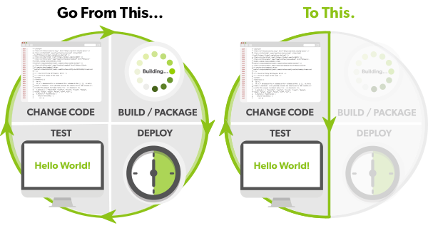
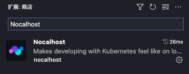
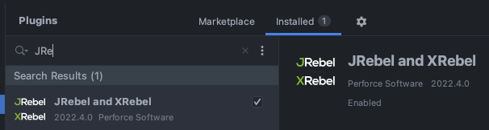
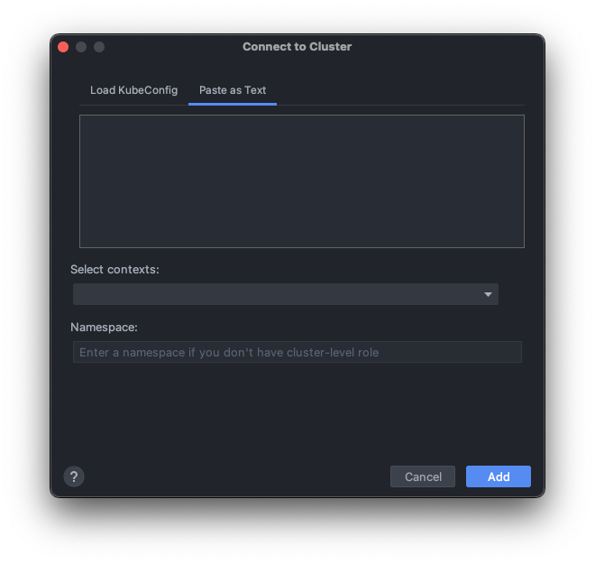
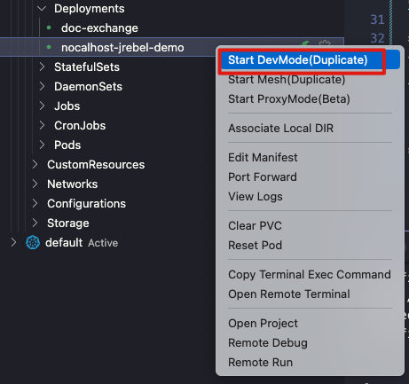
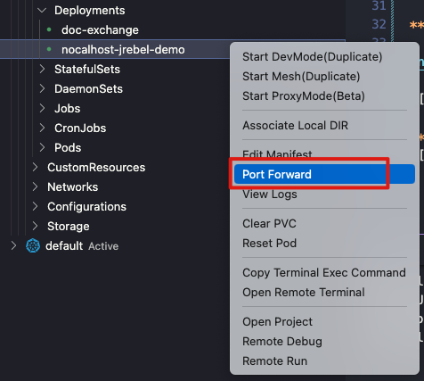
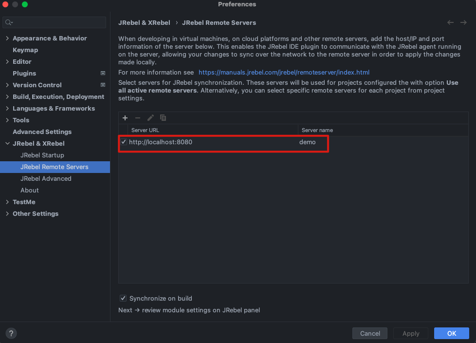
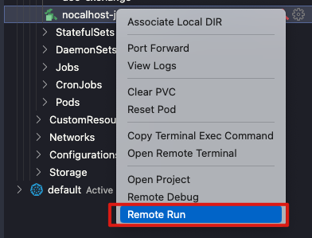
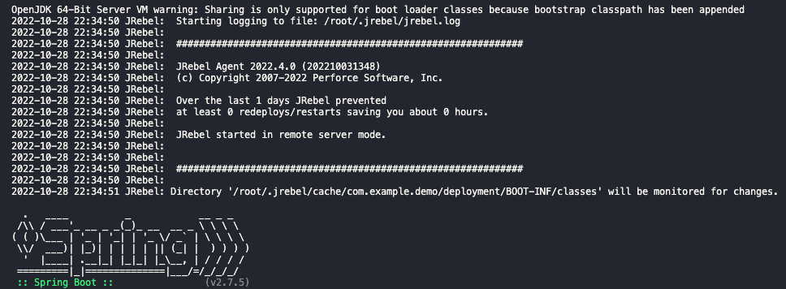

# Nocalhost + JRebel 云原生Java开发示例



## 📌 项目介绍

本仓库展示了如何在Kubernetes环境中结合使用Nocalhost和JRebel进行高效的Java应用开发。通过这种组合，您可以在本地修改Java代码后，代码变更会自动同步到Kubernetes集群中的容器，并实时生效——无需重建镜像或重启容器，真正体验云原生开发的便捷与高效。

### 🌟 主要特性

- **实时代码同步**：本地修改的代码自动同步到远程Kubernetes容器
- **即时热部署**：代码更改即刻在运行中的应用上生效，无需重启
- **本地IDE开发体验**：在云环境中保持与本地开发相同的舒适体验
- **开发与生产环境一致性**：减少"在我机器上能运行"的问题
- **加速开发循环**：显著减少等待构建和部署的时间

## 🔧 核心工具

### Nocalhost

[Nocalhost](https://nocalhost.dev/zh-CN/docs/introduction) 是一个强大的云原生开发工具：

- 允许开发者**直接在Kubernetes集群中**构建、测试和调试应用
- 提供易用的IDE插件（支持VS Code和JetBrains），保持与本地开发一致的体验
- 使用即时文件同步技术，无需重建镜像或重启容器，代码更改即刻生效
- 支持多种开发场景和复杂的微服务开发



### JRebel

[JRebel](https://jrebel.com/) 是业界领先的Java热部署工具：

- 能够在不重启Java应用的情况下，使代码更改即刻生效
- 支持广泛的Java框架和应用服务器
- 相比传统的开发-构建-部署循环，可节省大量开发时间
- 优化了开发体验，让开发者保持专注和生产力

## 🚀 配置步骤

### 1. 环境准备

**安装VS Code的Nocalhost插件**

从[VS Code市场](https://marketplace.visualstudio.com/items?itemName=nocalhost.nocalhost)安装Nocalhost插件。

**安装IntelliJ IDEA的JRebel插件**

从[JetBrains插件库](https://plugins.jetbrains.com/plugin/4441-jrebel-and-xrebel)安装JRebel插件。



### 2. Kubernetes集成

**将K8s集群添加到Nocalhost**

按照[官方文档](https://nocalhost.dev/zh-CN/docs/guides/manage-cluster)将您的Kubernetes集群与Nocalhost集成。

**构建并推送应用镜像**

执行[docker.sh](docker.sh)脚本构建和推送示例应用的Docker镜像（请根据您的环境调整脚本中的参数）：

```bash
# 构建Java应用
mvn clean install -Dmaven.test.skip
# 构建并推送Docker镜像
docker build -t nocalhost-jrebel-demo:v0.0.1 .
docker tag nocalhost-jrebel-demo:v0.0.1 YOUR-REGISTRY/nocalhost-jrebel-demo:v0.0.1
docker push YOUR-REGISTRY/nocalhost-jrebel-demo:v0.0.1
```



**部署应用到Kubernetes**

使用[k8s.yaml](k8s.yaml)配置文件部署应用到您的集群（请根据您的环境调整配置）。

### 3. 开发环境配置

**Nocalhost连接应用**

按照[官方指南](https://nocalhost.dev/zh-CN/docs/guides/deploy/deploy-app)将Nocalhost连接到您部署的应用。



**配置端口转发**

将远程Docker的接口转发到本地。这个步骤很重要，因为JRebel需要通过这个转发的地址和端口连接到远程环境。



**JRebel远程配置**

按照[JRebel远程服务器配置指南](https://manuals.jrebel.com/jrebel/remoteserver/intellij.html#intellijremoteserver)设置JRebel连接到远程环境。



**启动远程开发模式**

使用Nocalhost启动远程开发会话。



### 4. 开发与调试

成功配置后，您将看到类似下面的输出。现在您可以在本地修改Java代码，更改会自动编译并在远程容器中实时生效，无需重启应用或重建镜像。



## 💡 最佳实践

- 确保本地与远程环境的JDK版本一致，避免兼容性问题
- 定期检查文件同步状态，确保代码变更正确同步
- 使用Nocalhost提供的调试功能进行远程调试
- 保持本地与远程的依赖版本一致

## 🔍 问题排查

**常见问题**

- 如果代码变更没有生效，检查JRebel日志以确定问题所在
- 确保网络连接稳定，尤其是使用端口转发时
- 验证Kubernetes集群和容器运行状态
- 检查应用日志以获取更多信息

## 📘 相关资源

- [Nocalhost官方文档](https://nocalhost.dev/zh-CN/docs/introduction)
- [JRebel官方文档](https://manuals.jrebel.com/jrebel/)
- [Kubernetes开发最佳实践](https://kubernetes.io/docs/concepts/overview/working-with-objects/kubernetes-objects/)
- [Spring Boot开发指南](https://spring.io/guides/gs/spring-boot/)

## 🔗 关于作者

- 博客：[https://www.ifb.me](https://www.ifb.me)
- 微信公众号：Tech Playground


## 🤝 贡献

欢迎提交Issue和Pull Request来改进这个示例项目！

## 📄 许可

本项目采用MIT许可证开源。详见[LICENSE](LICENSE)文件。
